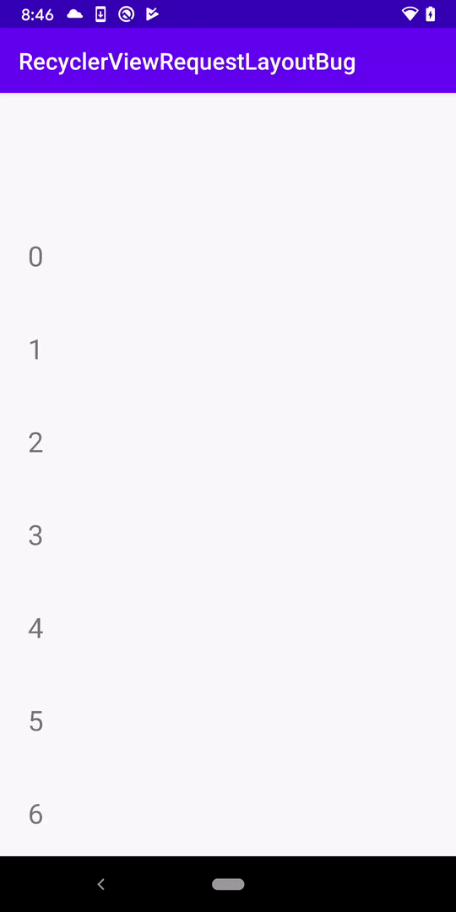

# RecyclerViewRequestLayoutBug

Bug in `constraintlayout:2.0.0-beta6`.

To reproduce, create a RecyclerView:
 - in a ConstraintLayout
 - with its height constrained, i.e. `match_parent`
 - with vertical padding
 - with `clipToPadding="true"`
 
Add a child item in the RecyclerView and invoke `requestLayout()` (or for a more realistic example, `setTextSize()`) on it.

**Expected behavior**: Nothing.

**Actual**: RecyclerView scroll position jumps.

